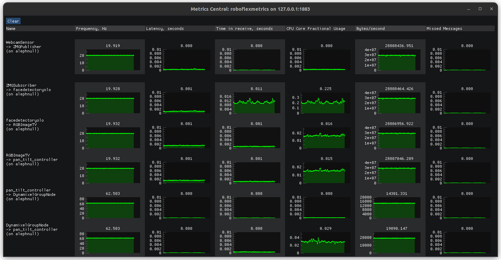

# roboflex_imgui

Roboflex visualizers and guis using IMGUI/IMPLOT

## System dependencies

Requires SDL and GLEW to be installed. More than likely, they already are installed in your distro. But if not:

    apt-get install libsdl2-dev
    apt-get install libglew-dev

    # or maybe on mac:

    brew install sdl2
    brew install glew
    brew install glfw

## pip install

    pip install roboflex.imgui

## Import

    import roboflex.imgui as rgu

## Nodes

There are two so far: **OneDTV** and **MetricsTelevision**

### OneDTV (One-Dimensional Television)

It expects to receive messages that contain a tensor under the key <data_key>. That tensor needs to be of shape (C, S), where C is number of channels, and S is sequence length. In general, C should be small (< 20), and S large. Think multiple audio channels.

    # all parameters optional: below are the defaults
    visualizer = rgu.OneDTV(
        data_key = "data",
        sample_size = 4,
        center_zero = True,
        initial_size = (640, 220),
        initial_pos = (-1, -1),
        name = "OneDTV",
        debug = False,
    )

    # must be started
    visualizer.start()

    # NOTE!!!
    # On some systems, such as mac, it's bad news to
    # run a UI on a non-main thread. So instead of 
    # calling start(), you can do this, which will 
    # run on the main thread. This call will block 
    # until the window is closed, in this case.
    visualizer.run()

### MetricsTelevision

Real-time visualization of metrics data as published by `GraphRoot::start(profile=True)`. I.e., when you instantiate a `GraphRoot` (from roboflex core), make it the root of your graph, and call myroot.start(profile=True) on it, it will publish metrics messages. This is the node that can visualize those metrcs message.

    # all parameters optional: below are the defaults
    visualizer = rgu.MetricsTelevision(
        window_title = "MetricsTelevision",
        initial_size = (1580, 720),
        initial_pos = (-1, -1),
        name = "MetricsTelevision",
        debug = False,
    )

    # must be started
    visualizer.start()

    # NOTE!!!
    # On some systems, such as mac, it's bad news to
    # run a UI on a non-main thread. So instead of 
    # calling start(), you can do this, which will 
    # run on the main thread. This call will block 
    # until the window is closed, in this case.
    visualizer.run()

### Using MQTT in this case

MQTT is an ideal transport for metrics messages - they are small and infrequent. We provide helper functions in `metrics_central.py` to do so:

    # give one of these to a GraphRoot as it's publisher node
    pub = rgu.metrics_central.get_metrics_mqtt_publisher(
        broker_address: str,
        broker_port: int = 1883,
        metrics_topic: str = "metrics",
    )

    # get a subscriber
    sub = rgu.get_metrics_mqtt_subscriber(
        broker_address: str,
        broker_port: int = 1883,
        metrics_topic: str = "metrics",
    )

    # get a visualizer
    vis = rgu.get_metrics_visualizer(
        broker_address: str,
        broker_port: int = 1883,
        metrics_topic: str = "metrics",
    )

    # connect the subscriber to the visualizer
    sub > vis

    # Here's a program that does it all - launches a MetricsVisualizer
    # listening to some mqtt broker:port and topic.
    python3 metrics_central.py

