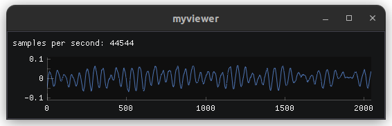

# roboflex_imgui

Roboflex visualizers and guis using IMGUI/IMPLOT

## System dependencies

Requires SDL and GLEW to be installed. More than likely, they already are installed in your distro. But if not:

    apt-get install libsdl2-dev
    apt-get install libglew-dev

    # or maybe on mac:

    brew install sdl2
    brew install glew

## pip install

    pip install roboflex.imgui

## Import

    import roboflex.imgui as rgu

## Nodes

There is only one so far: **OneDTV**

It expects to receive messages that contain a tensor under the key <data_key>. That tensor needs to be of shape (C, S), where C is number of channels, and S is sequence length. In general, C should be small (< 20), and S large. Think multiple audio channels.

    # all parameters optional: below are the defaults
    visualizer = rgu.OneDTV(
        data_key = "data",
        sample_size = 4,
        center_zero = True,
        initial_size = (640, 220),
        initial_pos = (-1, -1),
        name = "OneDTV",
        debug = False,
    )

    # must be started
    visualizer.start()

